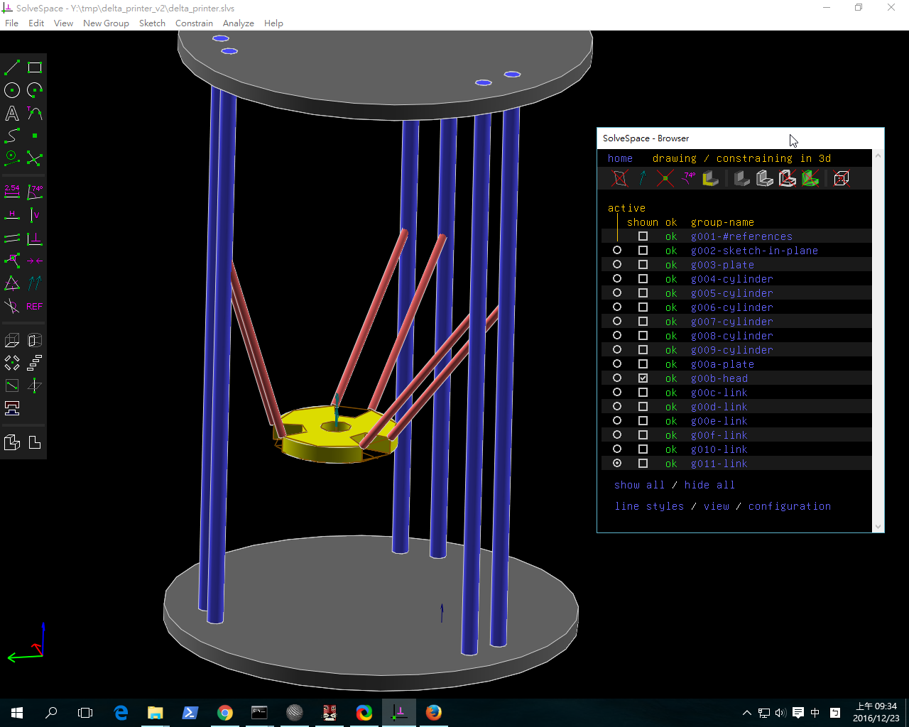
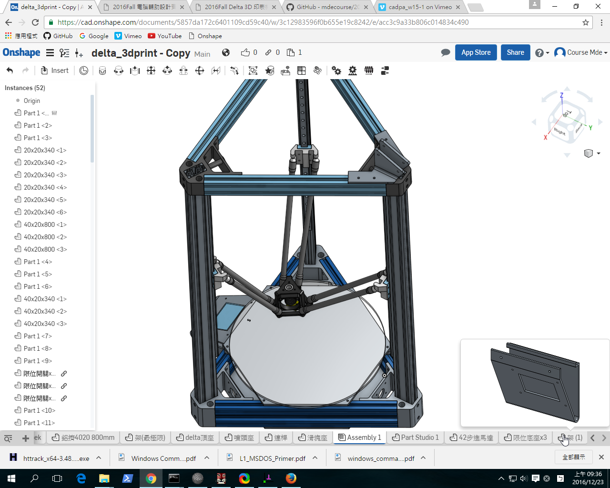

Title: 2016Fall Delta 3D 印表機設計
Date: 2016-11-06 15:00
Category: Misc
Tags: 使用導引, 創造力, 表達能力, 協同設計
Author: yen

各組自行透過 <a href="http://tw.misumi-ec.com/">http://tw.misumi-ec.com/</a> 尋找適用的標準零件, 下載 2D 與 3D 零件圖檔, 利用 Solvespace 與 OnShape 進行設計組立與模擬後, 實際下單購買各零組件, 完成 3D 印表機的設計與實作.

<!-- PELICAN_END_SUMMARY -->

W14 週零件採購

W15 Delta 3D Printer in Solvespace:

<iframe src="./../data/threejs/delta_in_solvespace.html" width="600" height="400"></iframe>

<a href="https://github.com/mdecourse/2016fallcadp/blob/gh-pages/course/delta_printer_v2.7z">Delta 3D Printer in Solvespace 零組件檔案</a>

W15 Delta 3D Printer in Onshape:

<a href="https://cad.onshape.com/documents/5857da172c6401109cd59c40/w/3c12983596f0b655e19c8242/e/acc3c9a33b806c014834c490">Delta 3D Printer in Onshape 零組件檔案</a>